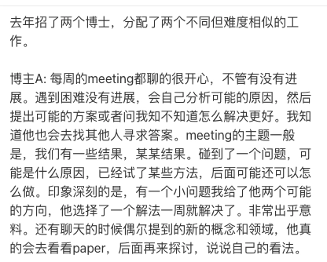

# 🧭 如何高效 Meeting

> 🧭 [首页](../../README.md) › [如何做科研](README.md) › **如何高效 Meeting**

## 为什么要 Meeting

1. Meeting主要是为了**帮助大家更高效地推进科研工作，而不是简单的工作进度汇报**，在科研的过程中会有试错的探索和没有进展的情况，不要把Meeting当成一种压力。
2. Meeting 的核心目标不是“证明自己做了很多事情”，而是**暴露问题、澄清思路、获得反馈、推进工作**。
3. 除了常规的定期Meeting之外，在项目推进过程中，有任何你觉得需要讨论的进展或者问题，都可以随时约时间讨论，**培养有问题就讨论的习惯**。

## Meeting 的组织形式

1. **针对在推进的Project：**
   1. 以Project为单位meeting，**Project leader要承担协调大家时间、约会议的任务.**
   2. 针对当前在做的Project，**每一个Project维护一个文档**，包含**整个Project要做的事情、Technical Contribution、时间规划、项目组成员及分工、当前的主要进展、实验结果和存在的问题；****不要长篇大论，凝练核心要点**
2. 如果个人还没有参与project，仍处于学习阶段
   1. 维护一个个人的进展文档，包括目前正在关注的事情、读的论文（**不要详细介绍，凝练核心观点即可**）、个人的思考和讨论
3. **Meeting频率**：
   1. **对于在推进的Project，至少2周meeting一次，中间有重要的结果和进展，可以随时约时间交流**
   2. **对于个人Meeting，建议博士生和硕士生至少2周Meeting一次、在外实习的研究生和本科实习生至少1个月一次**

## Meeting 模版

1. 每次Meeting之前，整理一下相比上次Meeting有哪些新的进展，大体逻辑可以按照如下方式组织：
   1. **Review一下整个项目的大方向和Contribution，反思自己是否在正确的道路上**
   2. **回顾一下上次meeting的结论和Todo**
   3. **总结一下自上次meeting后的进展，不要长篇大论，三句话以内讲清楚。**
   4. **列出想要讨论的问题、有意思的实验现象、观察等**
   5. **分享几篇最近读的论文，和对应的一句话内容总结**
   6. **后续的Todo list和时间安排**

## 实验室的讨论原则（**重要**）

1. **充分交流**，交流的时候不要害怕老师、高年级同学，不要因此而不敢问问题，有问题请及时问，实验室的老师、学长都非常友好，乐于解答问题。**讨论交流的唯一目的是: 正确、高效，能解决你对project的疑问。**
2. **平等交流**，不是汇报与被汇报的关系。如果科研上有自己的想法，请表达出来。如果觉得老师、师兄师姐有说错的地方，请有礼貌地质疑和讨论。不要一味地听信老师、学长的话，但更不要表面服从而底下做自己的想法，这样会浪费很多交流时间和实验成本。
3. **高效真诚**，不要搞太虚的东西，直入主题，高效沟通。
4. **事事有回应，**讨论的todo，要有效回应，不要讨论完就结束了。

## 典型正反面案例

为什么博士A好：

1. 有自己的思考：遇到困难、没有进展，会分析可能的原因，不是只说“效果不好”，而要进一步分析：为什么效果不好？是方法问题、数据问题、实现问题，还是假设本身不成立？这个失败说明了什么？是否可以从失败中提炼新的研究问题？
2. 讨论思路清晰：我们有XX结果，碰到了XX问题，可能是什么原因，己经试了XX方法，后面可能还可以怎么做。
3. 实验能力强：能够快速对一些方案进行尝试和结果分析。
4. 对新东西有好奇心：聊天的时候偶尔提到的新的概念和领域，会去看paper，再来探讨。

为什么博士B不好：

1. 只汇报，不讨论：每周meeting都是汇报，没有形成自己的思考和规划。
2. 缺少自己的思考：经常汇报效果不好，但是原因呢？没有分析。
3. 实验能力弱：不能很好的安排时间，快速的做可行方案的调研和试错。

---

⬅️ 上一篇：[如何进行学术汇报](04-presentation-如何进行学术汇报.md) ｜ ➡️ 下一篇：[一些好的习惯](06-good-habits-一些好的习惯.md)
