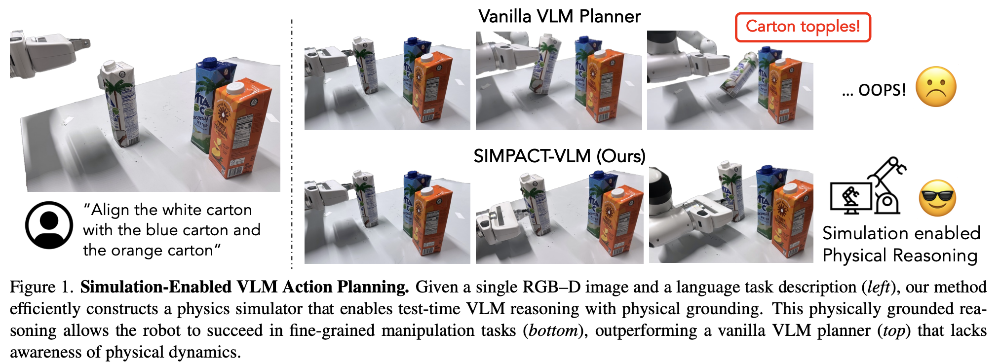

# 🎨 论文画图指南

> 🧭 [首页](../../README.md) › [如何写论文](README.md) › **论文画图指南**

## 总览

**好的论文配图应该帮助审稿人快速回答三个问题：**

1. **这篇论文解决了什么重要问题？**
2. **现有方法为什么不够好？**
3. **你的方法有什么优势？效果如何？**

很多审稿人第一次接触论文时，会先扫一遍标题、摘要、和论文的图表。因此，图画得好不好，会直接影响论文的第一印象。好的论文配图，能让读者在几秒内抓到论文的核心贡献。

一般来说，一篇文章的科研图表主要分为：

- **动机图：通常出现在论文开头附近，用来展示论文的核心动机、问题观察或方法优势，主要作用是快速引起读者的兴趣，让读者产生“这个问题确实重要，而且这篇论文的思路有意思”的感觉**
- **方法图：包括架构图、算法示意图、数据构造图等**
- **实验图：包括实验表格、柱状图、折线图、散点图、热力图、雷达图、案例可视化等**

前两者可以通过写提示词用AI先生成草图，再按照草图复现（使用PPT或Visio等等）自己修改微调；第三个则可以用coding agent写代码生成图表。

## 动机图（Teaser Figure）

一般放在论文的开头或者Introduction中，对于Teaser Figure，通常只需要围绕两个重点展开：

1. **问题或观察：论文要解决的问题？or 现有方法的局限？or 典型的、代表性的、反直觉的失败案例或观察**
2. **本文的优势：本文方法的优势是什么？**

动手画图之前，先想清楚一句话：

> **读者看完这张图，应该记住什么？**

如果这一句话想不清楚，图通常也画不清楚。

**基本原则：做到Self-Contain，即读者只看这幅图，不需要去翻阅论文其他内容，也能明白在讲什么。**

### 典型案例

#### 案例 1：现有方法 vs 本文方法

一边画现有方法的失败案例，另一边画本文方法如何解决，适合强调研究动机和核心insight的论文，例如：

#### 案例 2：形象对比

这篇论文也是通过对比的方式展示本文方法相比已有方法的优势，但不是通过具体例子来对比，而是采用抽象风格的形象来展示对比，也是值得借鉴的一种方式。

#### 案例 3：具体例子驱动

用一个任务、一个样本或者一个场景，展示出整个方法的运行效果，例如：

#### 案例 4：方法概览

文章工作量概览，适合benchmark类、或者工程量比较大的工作，例如：

## 方法流程图（Main Figure）

**清晰展示论文所提出的方法，让读者能够理解整个工作流以及核心的贡献**

**画图工作流：**

1. **先用一句话写清楚这张图要表达什么，作为该图的caption**
2. **列出必须出现的元素以及相应的流转关系，例如输出、输出、核心模块，中间信息是怎么流转的**
3. **画出大致布局，是上下分层、左右对比还是原型闭环？主流程从上到下还是从左到右？核心贡献放在哪里？**
4. **模块化和命名，把大块内容拆成清楚输入输出的模块，并给每个模块起一个名字。模块名字应当简短凝练，与正文一致。**
5. **统一视觉语言，确定颜色、形状、箭头、字体和图标风格。**

**核心原则：**

- 要像写代码一样模块化流程图，即，把方法拆成若干个有清晰输入输出的模块
- 每个模块有一个清楚的命名，应当与正文术语保持一致
- 模块之间要有箭头表示明确的流动关系，比如：数据的流动、反馈信息、训练先后顺序等等，不同的含义的箭头最好用不同样式区分，例如实线箭头表示主流程，虚线表示反馈，红色表示监督信号，灰色表示辅助信息等。
- 用颜色和形状辅助信息区分，同类模块使用同一种颜色，不同功能模块可以使用不同形状，颜色控制在3-5种，不使用高饱和度、高亮度的颜色。

### 案例 1：[Agentic Reasoning for Large Language Models](https://arxiv.org/pdf/2601.12538)（Survey）

每一个章节对应一个模块，每个模块采用不同的颜色，每个框都有一个名字和对应的章节名

### 案例 2：[Agentic Reasoning for Large Language Models](https://arxiv.org/pdf/2601.12538)（Method）

采用低饱和度的色块区分不同模块，每一个模块有各自的名字，不同功能的模块采用不一样的框和箭头（实线和虚线、不同颜色等），采用一些卡通元素丰富插图的内容

### 案例 3：[WAPITI: A Watermark for Finetuned Open-Source LLMs](https://arxiv.org/abs/2410.06467)（Method）

同样是低饱和、模块化布局，每个模块有名字，并且清晰的对比了本文方法（WAPITI Watermarking）相比已有方法(Direct Watermarking）的优势。这幅图比较有特点的是，在上方加了legend，表明不同的框、箭头、颜色的功能，让读者更容易看懂。

### 案例 4：[Language in the Flow of Time: Time-Series-Paired Texts Weaved into a Unified Temporal Narrative](https://arxiv.org/abs/2502.08942)（Method）

下图也是，通过不同的线表示不同的模块。

左侧虚线框表示输入，在虚线框内，上半部分表示时序模态，用绿色表示，下半部分表示文本模态，用另一种颜色表示。

右侧两个框，上下对比，红色表示既有方法，绿色表示本文方法，形成一个直观的对比，并且通过在右下角加上文字说明，直接体现本文方法的优势，又能让图右下角不那么空。

### 案例 5：[V-IRL: Grounding Virtual Intelligence in Real Life](https://virl-platform.github.io/static/V-IRL.pdf)（Method）

**这篇论文整体的配图和书写都非常漂亮，很值得参考。**

### 案例 6：[Unlocking the Capabilities of Thought: A Reasoning Boundary Framework to Quantify and Optimize Chain-of-Thought](https://proceedings.neurips.cc/paper_files/paper/2024/file/62ab1c2cb4b03e717005479efb211841-Paper-Conference.pdf)（Method）

通过插入各种小元素，丰富插图的内容和美观程度

### 案例 7：[Mem-Gallery: Benchmarking Multimodal Long-Term Conversational Memory for MLLM Agents](https://arxiv.org/pdf/2601.03515)（Benchmark）

Benchmark一般需要根据benchmark的工作量和特点，比如数据构建、评估指标、评测模型、findings等方面来设计模块，例如：

## 结果图表（Results）

### 相关工作对比图表（Related Works）

一般适用于benchmark类文章，适合与已有相关工作进行对比，整理出相应的维度，表明本文考虑了更多、更全面的setting。

#### 案例 1：设定相应的维度，通过不同颜色的符号，表明不同的论文具有不同的特点

#### 案例 2：这篇文章不是通过符号来对比，而是直接用文字说明在数据集Size、模态等维度的对比，并且通过一个很漂亮的图展示了该benchmark在Depth和Bredth上都处于最优

### 主结果（Main Results）

主结果通常适合用表格，因为表格能承载多 benchmark、多模型、多指标的精确对比。

主结果表的设计重点是：

> **让读者最快找到本文方法，并看到它超过了哪些 baseline。**

建议：

- 用 bold 标出最优结果；
- 用 underline 标出次优结果；
- 相同 backbone 或相同设置放在同一个 block；
- 不同 benchmark / metric 用清楚的列分组；
- caption 直接说明主要结论。
- **一个表不要太空，比如有的表格列间距、行间距非常大，给人感觉内容不充实，如果太空的话，可以通过调整布局，或者增加实验方差等内容，丰富表格信息。**

#### 案例 1：用底色标出本文方法性能，数字下面两条线表示第一名，一条线表示第二名，仅加粗表示第三名

#### 案例 2：用颜色深浅和加粗/横线区分性能，同时引入了金牌/银牌两个logo，最后一列通过红色/绿色表明性能增减

#### 案例 3：通过插入不同的logo表示不同算法的特点，增加表格内容的丰富程度和美观度

### 各类曲线（More Analysis）

通过曲线展示随着某个指标的变化，不同方法的性能变化，是除了表格之外最常用的实验结果图

#### 案例 1：可以在曲线上增加logo、性能增减的描述等等，让结果更直观

#### 案例 2：通过曲线后面的底色，表示算法的方差

## Some Tips

### 一、论文配色与色调工具

无论是论文插图还是实验曲线，配色要“简约大气，勿晃眼睛”，**拒绝高饱和**，科研图表最忌讳直接使用高饱和度的红绿蓝三原色，以下工具能帮你一键获取高高级、符合学术审美的调色盘。

- 基于PPT默认的色盘做一些调整，例如下面这幅图就是基于PPT的色盘配置

- **ColorKit (<https://colorkit.co/palettes/>)**：指南推荐的配色站，支持生成渐变色、提取图片颜色，能直观预览调色盘在图表中的实际效果。
- **ColorBrewer 2.0 (<https://colorbrewer2.org/>)**：经典的科学可视化配色标准，专门为地图和图表设计，支持选定“色盲友好（Colorblind safe）”和“黑白打印友好（Print friendly）”的配色方案，非常适合趋势图和柱状图。
- **SciVisColor (<https://sciviscolor.org/>)**：由美国国家科学基金会等支持开发的网站，专门针对科学数据可视化设计，提供极其专业的发散型和连续型调色盘。
- **Adobe Color (<https://color.adobe.com/>)**：通过色彩类比、互补等规则自制调色盘，也可以在“探索”模块搜索“Scientific”、“Academic”直接复用全球设计师分享的学术感配色。
- 在小红书、抖音、微信公众号等平台搜索“科研论文配色”相关的帖子，例如：
  - 
  - 
  - 

### 二、借助阴影、形状变化增加图片立体感

通过增加阴影、不同形状（实线、虚线）的线条，增加图像的立体感，例如下面两个例子：

### 三、矢量图标与素材库（适用于概览图/流程图）

概览图和流程图需要大量的概念性图标（如服务器、大脑、数据流、对比符号），使用统一风格的矢量图标（SVG/EPS）是保证“字体统一，风格一致”的关键

- **Flaticon (<https://www.flaticon.com/>)**：全球最大的免费矢量图标库。画概览图时，建议直接在里面搜索“Icon Pack”（图标包），确保整张图中的设备、用户、箭头等元素属于同一种设计风格（如皆为线条风或皆为扁平风），避免画面杂乱
- **iconfont-阿里巴巴矢量图标库 (<https://www.iconfont.cn/>)**：国内最强大的图标库，中文搜索极度友好。拥有海量由设计师打包好的开源图标库，支持免登录下载SVG/PNG
- **The Noun Project (<https://thenounproject.com/>)**：主打极致简约、高度概括的黑白符号图标。如果你的论文概览图追求高级的极简风，这里的素材是绝佳选择
- **BioRender (<https://biorender.com/>)**： 拥有海量专业的细胞、分子、实验设备矢量素材，支持拖拽拼装，堪称生物医学界的“PPT”

### 四、专业流程图与架构绘图工具

绘制“方法流程图”时，你需要强大的对齐、吸附和连线功能，确保箭头没有交叉、方向统一

- **Draw.io / Diagrams.net (<https://app.diagrams.net/>)**：完全免费且开源的强力绘图工具。拥有极其丰富的网络、云架构、通用流程图组件。支持网页版和桌面端，可直接导出为不失真、可二次编辑的 SVG 或 PDF 格式，是替代 Visio 的绝佳选择。
- **ProcessOn (<https://www.processon.com/>)**：国内主流的在线作图工具，上手极快。其“模板中心”有大量学者分享的现成科研流程图、系统架构图，可直接克隆修改。
- **Lucidchart (<https://www.lucidchart.com/>)**：功能极度丝滑的团队协作绘图软件，其连线的智能避让和排版对齐功能非常强大，适合处理复杂的系统多模块交互图。

### 五、实验数据图表代码与可视化库（适用于实验图表）

趋势图、柱状图等可以用 coding agent 写代码生成，给 Agent 发送指令时，指定以下业界标杆库，能让生成的图表自带高级感。

- **Python - Seaborn & Matplotlib**：科研界的老牌标杆。Seaborn 在 Matplotlib 的基础上进行了高级封装，自带多套极具学术感的学术主题主题（如 `whitegrid`），其默认配色比 Matplotlib 更现代。
- **Python - ProPlot (<https://proplot.readthedocs.io/>)**：专门为发表高质量学术论文设计的 Matplotlib 包装库。它极大地简化了多子图（Subplots）的排版对齐、标签共享以及学术配色的调用。

### 六、善用 AI 绘图与草图生成（适用于概览图创意）

方法流程图之类可以通过 AI 先生成创意草图，再手动复现修改。

- **GPT-Image-2 / Midjourney / DALL-E 3**：在生成方法概览图（Teaser Figure）的草图时，可使用提示词定义结构（例如：`"A structured, 3-part scientific diagram from left to right, clean background, pastel color palette, vector style..."`）来获取排版和视觉引导的灵感。

### 七、更多内容可以阅读[《科研论文配图绘制指南》](https://github.com/datawhalechina/paper-chart-tutorial)

### 💡 编写小贴士

> **素材使用铁律：**
>
> 1. **格式首选矢量**：从上述网站下载素材时，**务必优先选择** **`.svg`**、**`.eps`** 或 **`.pdf`** 格式。只有矢量图在无限放大、或者缩小到论文实际双栏尺寸时，才能保证文字和线条绝对清晰、不掉字。
> 2. **版权合规**：商业或开源图标库在免费使用时，注意查看其开源协议（如 CC BY 3.0 需在文章致谢或 Caption 中注明出处，或选择完全开源的 CC0 资源），避免版权争议。

---

⬅️ 返回：[如何写论文](README.md) ｜ ➡️ 下一篇：[如何写论文-Abstract](02-abstract-如何写论文-Abstract.md)
