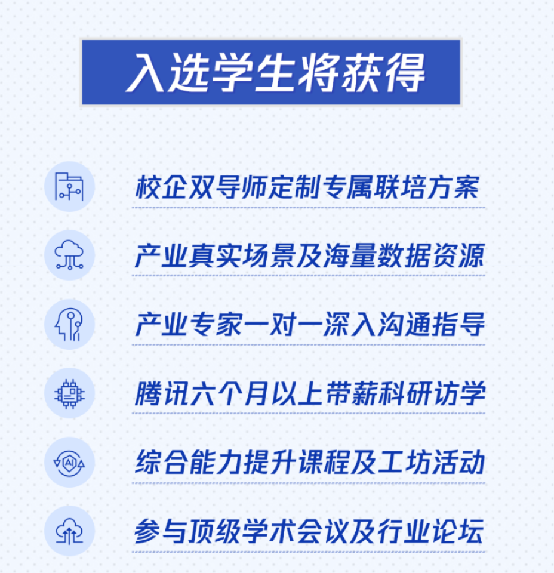

# 💰 有哪些能申请的奖学金？

> 🧭 [首页](../../README.md) › [杂项](README.md) › **有哪些能申请的奖学金**

本文档汇总了各类本科生、研究生能申请的社会奖学金，供大家参考

## 本科生奖学金

1. 商汤奖学金
   1. https://www.sensetime.com/cn/scholarship
   2. 通常关注月份：3–4 月
   3. 本科二、三、四年级学生，不多于30名获奖者，每一位获奖者提供20,000元
2. CCF优秀大学生启航计划
   1. [链接](https://www.ccf.org.cn/rewardsandincentives/incentiveproject/yxdxsqhjh/#:~:text=“CCF大学生启航计划”简称“CCF优秀大学生”（CCF Elite Collegiate Award），资助学习成绩优秀、在专业科研实践活动中表现出色；有社会责任感、积极参加社会活动和公益活动的计算机（或相关）专业在读全日制三年级、四年级本科生。,该计划实行开放式推荐，每年评选一次，资助人数约105人。 候选人资格： 当年6月在高校计算机（或相关）专业就读的全日制三年级和四年级的本科生。 名额分配：)
   2. 通常关注月份：6–7 月
   3. 当年6月在高校计算机（或相关）专业就读的全日制三年级和四年级的本科生，学校推荐
3. Generation Google Scholarship APAC
   1. https://opportunitydesk.org/2025/07/24/generation-google-scholarship-for-women-in-computer-science-2025-2026-asia-pacific-apac/（本轮官网已关闭，只有相关介绍）
   2. 通常关注月份：4–8 月浮动
   3. 亚太地区女性 CS 本科生，$2500，当前轮次关闭，需等下一轮。
4. 腾讯犀牛鸟精英人才计划（结项答辩的时候会奖学金评优）
   1. https://www.wizsci.com/project/detail/1765
   2. 通常关注月份：1–2 月
   3. 本科生（大三及以上）、硕士及博士生
      1. 
5. 国家自然科学基金青年学生基础研究项目（本科生项目）
   1. 通常关注月份：6 月左右校内遴选
   2. 学校作为依托单位组织推荐

### 表格版

| 序号 | 项目                                               | 链接                                                         | 通常关注月份     | 申请对象 / 申请方式                                          | 资助内容 / 备注                                |
| ---- | -------------------------------------------------- | ------------------------------------------------------------ | ---------------- | ------------------------------------------------------------ | ---------------------------------------------- |
| 1    | 商汤奖学金                                         | https://www.sensetime.com/cn/scholarship                     | 3–4 月           | 本科二、三、四年级学生                                       | 不多于 30 名获奖者；每位获奖者 20,000 元       |
| 2    | CCF优秀大学生启航计划                              | [链接](https://www.ccf.org.cn/rewardsandincentives/incentiveproject/yxdxsqhjh/#:~:text=“CCF大学生启航计划”简称“CCF优秀大学生”（CCF Elite Collegiate Award），资助学习成绩优秀、在专业科研实践活动中表现出色；有社会责任感、积极参加社会活动和公益活动的计算机（或相关）专业在读全日制三年级、四年级本科生。,该计划实行开放式推荐，每年评选一次，资助人数约105人。 候选人资格： 当年6月在高校计算机（或相关）专业就读的全日制三年级和四年级的本科生。 名额分配：) | 6–7 月           | 当年 6 月在高校计算机或相关专业就读的全日制三年级、四年级本科生；学校推荐 | 须通过学校推荐                                 |
| 3    | Generation Google Scholarship APAC                 | [链接](https://opportunitydesk.org/2025/07/24/generation-google-scholarship-for-women-in-computer-science-2025-2026-asia-pacific-apac/) （本轮官网已关闭，暂用相关介绍页） | 4–8 月浮动       | 亚太地区女性 CS 本科生                                       | 2,500 美元；当前轮次关闭，需等下一轮           |
| 4    | 腾讯犀牛鸟精英人才计划                             | https://www.wizsci.com/project/detail/1765                   | 1–2 月           | 本科生大三及以上、硕士生、博士生                             | 企业科研人才计划；结项答辩阶段可能有奖学金评优 |
| 5    | 国家自然科学基金青年学生基础研究项目（本科生项目） | 以学校/教务处/学院通知为准；总入口可关注 https://www.nsfc.gov.cn/ | 6 月左右校内遴选 | 学校作为依托单位组织推荐                                     | 国家级科研资助，不是普通奖学金                 |

## 研究生、博士生奖学金

1. 腾讯青云奖学金
   1. https://join.qq.com/scholarship.html
   2. 通常关注月份：10–11 月
   3. 中国国籍的硕士和博士，为每位获奖者提供人民币20万元现金和价值人民币30万元的云异构算力资源
2. 字节跳动奖学金
   1. https://scholarship.bytedance.com/
   2. 通常关注月份：5–6 月
   3. 写的是“本硕博各学段”，实际基本是博士获奖，10 万元人民币
3. 百度奖学金
   1. http://scholarship.baidu.com/
   2. 通常关注月份：10–11 月
   3. 奖学金每年奖励8-10名硕、博在读研究生，每位获奖者获得20万元（10万元/年/人，连续提供两年）
4. 蚂蚁 InTech 奖学金
   1. https://www.antresearch.com/Cooperation/InTech
   2. 通常关注月份：7 月
   3. 在读中国青年博士，每年评选一次，共评选出不超过10名获奖者，获奖者每人获得5万元(税前)人民币奖金
5. 凌迪图形学奖学金 Style3D Graduate Fellowship
   1. https://tc.ccf.org.cn/ldtxxjxj/
   2. 通常关注月份：6–7 月前
   3. 旨在发掘、支持和激励优秀的、有潜力的低年级博士生、硕士生
   4. 每年评选 10 名，每人 3 万元
6. 中国电子学会—腾讯博士生科研激励计划：混元大模型专项
   1. https://www.wizsci.com/project/detail/1733
   2. 通常关注月份：4–5 月
   3. 2024、2025都有，2026暂时没看到
   4. 中国籍博士生，不超过25人，入选者每人10万元（税前），为期一年
7. 腾讯犀牛鸟精英人才计划（见本科生部分）
8. 国家自然科学基金青年学生基础研究项目（博士研究生项目）
   1. 通常关注月份：8–9 月校内推荐
   2. 学校作为依托单位组织推荐
9. 中国科协青年科技人才培育工程博士生专项计划
   1. [链接](https://www.cast.org.cn/rc2/fwyfz/zgkxqnkjrcpygc/bsszxjh/art/2025/art_5d6de0d050544e6c9828547489b9fe21.html)
   2. 通常关注月份：10–11 月
   3. 为更好地实现培育目标，2025年在申请条件中增加了“原则上距离毕业时间在2年以上”的要求，以确保入选者有充足的时间和精力参与各类培育活动。
   4. 对距离毕业时间不满两年的博士生，如立志长期在国内从事科技工作，在承诺攻读博士学位期间完成不少于240学时培育活动的基础上，也可申请参加。
10. CCF博士学位论文激励计划
    1. https://www.ccf.org.cn/rewardsandincentives/incentiveproject/bsxwlwjljh/
    2. 通常关注月份：8–9 月
    3. 博士论文奖，不是读博期间奖学金
11. ACM Doctoral Dissertation Award
    1. https://awards.acm.org/doctoral-dissertation
    2. 通常关注月份：10 月底；需翻译则 11 月底
    3. 国际博士论文奖，不是在读奖学金
    4. 计算机科学与工程方向博士论文作者。获奖论文奖金 20,000 美元，Honorable Mention 奖金 10,000 美元，只能由博士导师提名
12. 谷歌博士奖学金 Google PhD Fellowship
    1. https://research.google/programs-and-events/phd-fellowship/
    2. 通常关注月份：3–4 月
    3. 由所在大学提名获得奖学金，由大学的官方代表在申请窗口期间提交。
13. 苹果学者 Apple Scholars in AIML
    1. https://machinelearning.apple.com/work-with-us#scholars
    2. 通常关注月份：7–9 月校内提名；次年 4 月公布结果
    3. 受邀高校提名制
14. NVIDIA Graduate Fellowship
    1. https://research.nvidia.com/graduate-fellowships
    2. 通常关注月份：8–9 月
    3. 计划为在加速计算及其应用领域带来重大进展的博士生提供高达 60,000 美元的资助，该奖学金还包括在奖学金年度之前进行强制性的现场暑期实习
15. IBM PhD Fellowship Awards
    1. https://research.ibm.com/labs/yorktown-heights/ibm-academic-awards-program
    2. 通常关注月份：7–9 月或 9–10 月，需看当年邀请
    3. 全球博士生，不是学生自荐；需 faculty 获得邀请后提名，提名教师需使用大学邮箱提交材料。
    4. 美国高校奖金额为 40,000 美元；其他国家/地区通常为 6,000–25,000 美元，具体随学校所在国家/地区而定
16. ACM SIGHPC Computational & Data Science Fellowships
    1. https://www.acm.org/articles/bulletins/2020/march/sighpc-and-george-michael-fellowships-noms
    2. 通常关注月份：3–5 月
    3. PhD 获奖者最长可获 4 年支持，MS 获奖者最长可获 2 年支持。
    4. 需已在读或即将进入研究生项目，攻读 Master、PhD 或 equivalent，并且通常要求尚未完成培养计划的一半；候选人应为女性或代表性不足群体成员。

### 表格版

| 序号 | 项目                                                   | 链接                                                         | 通常关注月份                      | 申请对象 / 申请方式                                          | 资助内容 / 备注                                              |
| ---- | ------------------------------------------------------ | ------------------------------------------------------------ | --------------------------------- | ------------------------------------------------------------ | ------------------------------------------------------------ |
| 1    | 腾讯青云奖学金                                         | https://join.qq.com/scholarship.html                         | 10–11 月                          | 中国国籍硕士生、博士生                                       | 每位获奖者获得人民币 20 万元现金和价值人民币 30 万元的云异构算力资源 |
| 2    | 字节跳动奖学金                                         | https://scholarship.bytedance.com/                           | 5–6 月                            | 官方写“本硕博各学段”；实际获奖者基本以博士生为主             | 10 万元人民币                                                |
| 3    | 百度奖学金                                             | http://scholarship.baidu.com/                                | 10–11 月                          | 每年奖励8-10名硕士、博士在读研究生                           | 每年奖励 8–10 名；每位获奖者获得 20 万元，10 万元/年/人，连续两年 |
| 4    | 蚂蚁 InTech 奖学金                                     | https://www.antresearch.com/Cooperation/InTech               | 7 月                              | 在读中国青年博士                                             | 每年评选不超过 10 名；每人获得 5 万元税前人民币奖金          |
| 5    | 凌迪图形学奖学金 Style3D Graduate Fellowship           | https://tc.ccf.org.cn/ldtxxjxj/                              | 6–7 月前                          | 优秀、有潜力的低年级博士生、硕士生                           | 每年评选 10 名；每人 3 万元                                  |
| 6    | 中国电子学会—腾讯博士生科研激励计划：混元大模型专项    | https://www.wizsci.com/project/detail/1733                   | 4–5 月                            | 中国籍博士生                                                 | 2024、2025 都有，2026 暂时没看到；不超过 25 人；入选者每人 10 万元税前，为期一年 |
| 7    | 腾讯犀牛鸟精英人才计划                                 | https://www.wizsci.com/project/detail/1765                   | 1–2 月                            | 本科生大三及以上、硕士生、博士生                             | 见本科生部分；属于企业科研人才计划，非传统奖学金             |
| 8    | 国家自然科学基金青年学生基础研究项目（博士研究生项目） | 以学校科研院/研究生院通知为准；总入口可关注 https://www.nsfc.gov.cn/ | 8–9 月校内推荐                    | 学校作为依托单位组织推荐                                     | 国家级科研资助，不是普通奖学金                               |
| 9    | 中国科协青年科技人才培育工程博士生专项计划             | https://www.cast.org.cn/rc2/fwyfz/zgkxqnkjrcpygc/bsszxjh/art/2025/art_5d6de0d050544e6c9828547489b9fe21.html | 10–11 月                          | 中国籍全日制在读博士生                                       | 2025 年申请条件增加“原则上距离毕业时间在 2 年以上”；距离毕业不足 2 年者，如承诺攻读博士期间完成不少于 240 学时培育活动，也可申请 |
| 10   | CCF博士学位论文激励计划                                | https://www.ccf.org.cn/rewardsandincentives/incentiveproject/bsxwlwjljh/ | 8–9 月                            | 计算机相关方向博士论文作者                                   | 博士论文奖，不是读博期间奖学金                               |
| 11   | ACM Doctoral Dissertation Award                        | https://awards.acm.org/doctoral-dissertation                 | 10 月底；需翻译则 11 月底         | 计算机科学与工程方向博士论文作者；只能由博士导师提名         | 国际博士论文奖，不是在读奖学金；获奖论文奖金 20,000 美元，Honorable Mention 奖金 10,000 美元 |
| 12   | 谷歌博士奖学金 Google PhD Fellowship                   | https://research.google/programs-and-events/phd-fellowship/  | 3–4 月                            | 博士生；由所在大学提名，由大学官方代表在申请窗口期间提交     | 国际企业博士奖学金；学生通常不能完全个人直申                 |
| 13   | 苹果学者 Apple Scholars in AIML                        | https://machinelearning.apple.com/work-with-us#scholars      | 7–9 月校内提名；次年 4 月公布结果 | AI/ML 方向博士生；受邀高校提名制                             | 高含金量企业博士奖学金；是否可申取决于所在高校是否被邀请     |
| 14   | NVIDIA Graduate Fellowship                             | https://research.nvidia.com/graduate-fellowships             | 8–9 月                            | 加速计算及其应用相关方向博士生                               | 最高 60,000 美元资助；包含奖学金年度之前的强制现场暑期实习   |
| 15   | IBM PhD Fellowship Awards                              | https://research.ibm.com/labs/yorktown-heights/ibm-academic-awards-program | 7–9 月或 9–10 月，需看当年邀请    | 全球博士生；不是学生自荐，需 faculty 获得邀请后提名，提名教师需使用大学邮箱提交材料 | 美国高校奖金额为 40,000 美元；其他国家/地区通常为 6,000–25,000 美元，具体随学校所在国家/地区而定 |
| 16   | ACM SIGHPC Computational & Data Science Fellowships    | https://www.acm.org/articles/bulletins/2020/march/sighpc-and-george-michael-fellowships-noms | 3–5 月                            | 已在读或即将进入 Master、PhD 或 equivalent 项目的研究生；通常要求尚未完成培养计划的一半；候选人应为女性或代表性不足群体成员 | PhD 获奖者最长可获 4 年支持；MS 获奖者最长可获 2 年支持      |

---

⬅️ 上一篇：[学术会议参会指南](01-conference-学术会议参会指南.md) ｜ ➡️ 下一篇：[AI 辅助科研的一些 Tips](03-ai-tips-AI辅助科研tips.md)
